# Trading Partner

**A local-first investment judgment companion for A-shares, US and Korean markets, and selected cross-asset facts.**

[](https://github.com/KarlZhu-ZXC/trading-partner/actions/workflows/quality.yml)
[](https://github.com/KarlZhu-ZXC/trading-partner/releases)
[](https://www.python.org/)
[](LICENSE)
[](https://paypal.me/xczhu)

<p align="center">
  
</p>

Trading Partner is a durable research and portfolio context service exposed through
the [Model Context Protocol](https://modelcontextprotocol.io/). Connect it to Codex
or another MCP host and the conversation can retrieve your positions, Watchlist,
past research, research files (instrument-centered Investment Cases by default), investment-judgment
revisions (Thesis revisions), challenge reviews, monitoring
events, and current market facts without rebuilding context from scratch.

The MCP supplies structured facts and durable state. Your AI host remains responsible
for interpretation, debate, and the final answer.

##  Why Trading Partner?

Most investment chats forget what you believed last month, why you bought something,
which evidence would invalidate the thesis, and whether a new claim contradicts an
older one. Trading Partner gives the conversation a persistent research memory and a
fact layer designed to challenge decisions over time—not merely summarize today's
market.

Every precise result carries provenance such as source, observation time, freshness,
basis, and typed warnings. Missing or stale data is disclosed instead of fabricated.

##  What it can do

- Maintain a durable research file for an instrument or higher-level topic, including
  its current investment judgments, revision history, journals, decisions, and
  contrary-first Challenge Reviews.
- Resolve A-share, US, and selected Korea Exchange instruments and retrieve provider-backed market,
  fundamental, filing, macro, news, sentiment, and prediction-market context.
- Resolve supported typed IDs automatically on first use and fetch up to 50 quotes
  per bounded batch with one typed result per instrument.
- Read positions and transactions from Schwab, Moomoo OpenD, or strict manual CSV
  sources; durable reads never contact a broker, while refresh is explicit and read-only.
- Persist Moomoo or CSV Watchlists with group and membership history; Moomoo's
  aggregate `All` group is the default durable read scope.
- Analyze portfolio exposure, simulate additions, and run deterministic Risk Engine v2
  checks without placing orders.
- Propose and explicitly confirm versioned Trade Plans, calculate non-executing A-share/US
  position-sizing ranges, and compile machine-evaluable plan conditions into durable monitors.
- Create durable price, volume, technical, fundamental, company-event, macro, sentiment,
  Thesis-state, and portfolio-risk monitors with transition-only events.
- Produce shared A-share/US/KR daily and weekly technical analysis, including indicators,
  market structure, support/resistance, candlestick patterns, and PNG charts.
- Retrieve free COMEX/NYMEX continuous metal-futures facts with Yahoo primary,
  scoped Sina quote and Eastmoney daily-derived fallbacks, and 1m–monthly
  bars with explicit non-spot and contract-roll warnings.
- Resolve formal CME metal contracts, build official-reference settlement curves,
  and read DCE live-hog EOD contract facts through one shared futures model.
- Read free Dukascopy XAUUSD/XAGUSD broker-feed quotes and bars plus a separately
  labelled rolling copper CFD; never relabel them as LBMA/LME benchmarks.
- Retrieve official national hog-cycle price, feed, pig-grain-ratio, and capacity
  observations with publication-time cutoffs and no fabricated phase verdict.
- Run repeatable deep-dive, catalyst, market-review, portfolio-review, and explicit
  same-market peer-comparison workflows while keeping the AI host as the synthesizer.
- Prepare hashed LEAN strategy packages for user-operated QuantConnect Free web
  backtests and import downloaded result JSON with explicit reproducibility gaps.
- Browse system health, all 28 MCP capabilities, Monitor runs/events, durable
  accounts/Watchlists, and operational state in an LLM-free local web console.

##  Safety boundary

Trading Partner is a research service, not a broker or autonomous trading agent.

It does **not** expose order placement, fills, live execution, a local/remote
automated backtest runner, or autonomous thesis confirmation. Its QuantConnect Free
bridge only prepares code and imports a result after the user operates the web UI.
Technical outputs are derived facts—not forecasts, strategies, or trade signals.
Ordinary portfolio questions read durable snapshots; broker refreshes happen only
when explicitly requested.

##  Quick start

Requirements:

- Python 3.13
- [uv](https://docs.astral.sh/uv/)

```bash
git clone https://github.com/KarlZhu-ZXC/trading-partner.git
cd trading-partner

uv sync
cp .env.example .env
uv run alembic upgrade head
```

`uv sync` installs the complete development environment in a source checkout. For a
minimal production installation, install the core package and select only the
capabilities you use: `accounts-moomoo`, `accounts-schwab`, `chart`, or `company-pdf`.
`trading-partner[all]` installs every optional runtime integration.

Edit `.env` only for the providers and account sources you want to use. Safe defaults
work without broker credentials; unavailable optional providers return explicit
degradation metadata.

Start the local stdio MCP server:

```bash
uv run trading-partner-mcp
```

The repository includes a Codex project configuration in `.codex/config.toml`. For a
generic stdio MCP host, use the equivalent configuration:

```json
{
  "mcpServers": {
    "trading-partner": {
      "command": "uv",
      "args": [
        "--directory",
        "/absolute/path/to/trading-partner",
        "run",
        "trading-partner-mcp"
      ]
    }
  }
}
```

After connecting, call `system_health` first. Then verify the specific market and
account providers you intend to use; a healthy MCP process does not imply that every
optional external provider is configured or reachable. Health output labels local
live probes separately from configuration-only checks.

##  Operational commands

```bash
# Exact Watchlist refresh
uv run trading-partner-watchlist-sync

# Due-checked US post-market account and Watchlist refresh
uv run trading-partner-post-market-sync

# Diagnose Schwab token age without opening a browser
uv run trading-partner-schwab-auth status

# Manually force one market-close cadence (diagnostic use)
uv run trading-partner-monitor-run --cadence US_POST_MARKET
uv run trading-partner-monitor-run --cadence A_SHARE_POST_MARKET
uv run trading-partner-monitor-run --cadence KR_POST_MARKET

# Install the token-free unified hourly dispatcher
uv run trading-partner-monitor-scheduler install
uv run trading-partner-monitor-scheduler status

# Due-check INTERVAL plus A-share/US/KR post-market groups
uv run trading-partner-monitor-run due

# Optional Telegram delivery: inspect, test, or retry the durable outbox
uv run trading-partner-monitor-notifications status
uv run trading-partner-monitor-notifications test
uv run trading-partner-monitor-notifications flush

# Explicitly refresh free futures definitions and persist EOD statistics
uv run trading-partner-futures-sync --product CME:GC --trade-date 2026-07-24

# Start the loopback-only console API (frontend: cd console && npm run dev)
uv sync --extra console
uv run trading-partner-console

# Inspect retention, create a backup, or preview expired-cache pruning
uv run trading-partner-maintenance status
uv run trading-partner-maintenance backup
uv run trading-partner-maintenance prune-cache --retention-days 30
```

These commands never execute an order.

Telegram delivery is opt-in. Create a bot with Telegram's `@BotFather`, send the
bot one message, then set `MONITOR_NOTIFICATIONS_ENABLED`, `TELEGRAM_BOT_TOKEN`,
and `TELEGRAM_CHAT_ID` in the gitignored `.env`. Only Monitor state-transition
events are pushed; repeat observations remain in run history without notifying
again. The hourly local dispatcher retries the durable outbox without opening a
Codex task or consuming LLM tokens.
The unified dispatcher also owns A-share, US, and KR post-market Monitor execution;
Codex market-review Automations must not duplicate Monitor evaluation or alerts.

##  Architecture

```text
src/
├── bootstrap.py          # composition root
├── application/          # ports, DTOs, use cases
├── domain/               # pure domain model
├── infrastructure/       # composition builders, persistence, providers, config
└── interfaces/           # MCP adapters
```

```text
interfaces ───────→ application ───────→ domain
infrastructure ───→ application ports ─→ domain
```

The domain has no dependency on MCP, SQLAlchemy, Alembic, settings, or provider SDKs.
Provider payloads are normalized at the infrastructure boundary, and only
`src/bootstrap.py` connects infrastructure ports to application services. The
resulting container exposes five explicit bundles (`context`, `resources`,
`providers`, `services`, and `operations`) instead of a flat service locator.
Infrastructure-owned construction lives under `infrastructure/composition/`, while
SQLAlchemy declarations are grouped under `infrastructure/persistence/orm/`.

##  Data-source routing

The diagram shows the runtime source chain, including scoped fallbacks. A fallback
never changes an instrument's identity or silently upgrades a broker/derived value
into an official benchmark.

```mermaid
flowchart TB
    Host[Codex or another MCP host] --> MCP[Trading Partner MCP<br/>28 compact research tools]
    MCP --> App[Application services<br/>cutoffs · freshness · typed degradation]
    App --> Router[Asset-aware Provider Router<br/>cache · limiter · fallback policy]
    App <--> Store[(SQLite / configured DB<br/>research memory · cases · plans<br/>snapshots · watchlists · monitors)]

    subgraph CN[A-share facts]
        CNMarket[Tencent · Eastmoney · Sina<br/>quotes · bars · capital]
        CNDisclosure[CNINFO · SSE · SZSE<br/>filings · operating disclosures]
        CNSentiment[THS · Eastmoney rankings<br/>CLS · optional iWencai]
        CNIndustry[NAHS<br/>official hog-cycle observations]
    end

    subgraph US[US market and company facts]
        Yahoo[Yahoo Finance<br/>quotes · bars · screeners · news]
        AV[Alpha Vantage key pool<br/>market/company fallback]
        SEC[SEC EDGAR<br/>filings · point-in-time company facts]
        FRED[FRED / ALFRED<br/>vintage-safe macro]
        Social[Reddit RSS → Apify fallback<br/>Moomoo public community feed]
        Prediction[Polymarket<br/>current probabilities]
    end

    subgraph KR[Korea Exchange market facts]
        KRYahoo[Yahoo Finance<br/>.KS · .KQ · KOSPI/KOSDAQ indices<br/>quotes · bars]
        XKRX[XKRX calendar<br/>holiday-aware post-market cadence]
    end

    subgraph Cross[Metals, futures, and cross-asset]
        Continuous[Yahoo continuous futures<br/>→ Sina quote fallback<br/>→ Eastmoney daily-bar fallback]
        CME[CME public reference<br/>contracts · settlement · curve]
        DCE[DCE public EOD<br/>live-hog contracts · settlement]
        Jetta[Dukascopy Jetta keyless<br/>XAUUSD · XAGUSD · rolling copper CFD]
        Legacy[optional legacy Dukascopy key API]
        Jetta -. failure with configured key .-> Legacy
    end

    subgraph Personal[Personal read-only context]
        Accounts[Schwab · Moomoo OpenD · manual CSV<br/>balances · positions · transactions]
        Watchlists[Moomoo OpenD or manual CSV<br/>one active upstream]
        Hot[Moomoo OpenD Hot List<br/>optional market context]
    end

    Router --> CNMarket
    Router --> CNDisclosure
    Router --> CNSentiment
    Router --> CNIndustry
    Router --> Yahoo
    Router --> AV
    Router --> SEC
    Router --> FRED
    Router --> Social
    Router --> Prediction
    Router --> KRYahoo
    App --> XKRX
    Router --> Continuous
    Router --> CME
    Router --> DCE
    Router --> Jetta
    App --> Accounts
    App --> Watchlists
    Router --> Hot

    Proxy[optional PROVIDER_PROXY_URL<br/>CME · DCE · Dukascopy · Polymarket] -. network route .-> Router
```



Dukascopy follows the current `dukascopy-node` Jetta strategy: 1-minute data is
requested by UTC day, hourly data by UTC month, and daily data by UTC year. Requests
run in batches of at most 10 with a one-second inter-batch pause; completed buckets
are cached, active `from` buckets are not, and automatic retries default to zero.
These are client pacing rules—not a claim that Dukascopy publishes a fixed requests-
per-minute quota.

##  Data and secrets

- Static secrets live in the project-root `.env`, which is gitignored.
- Rotating provider OAuth tokens live under `data/secrets/`, which is also gitignored.
- Durable research and account state stays in your configured local database.
- Credentials are redacted from logs, MCP envelopes, exceptions, and audit payloads.
- Each user should supply their own provider credentials and maintain their own data
  store; never share an `.env` or broker token directory.

##  Documentation

- [MCP capability and trust boundary](docs/guide/mcp-capability-boundary.md)
- [Documentation index](docs/README.md)
- [Known operational issues](docs/operations/known-issues.md)
- [Product roadmap](docs/roadmap/global-roadmap-cn-us.md)
- [Security policy](SECURITY.md)

##  Development

```bash
uv run ruff check .
uv run mypy src
uv run pytest
uv run python scripts/smoke_isolated_wheel.py
uv run pip-audit
uv run cyclonedx-py environment .venv/bin/python --pyproject pyproject.toml -o /tmp/trading-partner.cdx.json
cd console && npm ci && npm audit && npm run lint && npm test
gitleaks git --redact --no-banner --log-opts=HEAD
```

Upstream projects under `references/` are design references only and are not runtime
dependencies. See each `UPSTREAM.md` for its pinned revision and attribution.

##  Support

If Trading Partner is useful to you, consider
[buying me a coffee through PayPal](https://paypal.me/xczhu).

[](https://paypal.me/xczhu)

##  License

Licensed under [Apache License 2.0](LICENSE). Third-party attribution is recorded in
[NOTICE](NOTICE).
