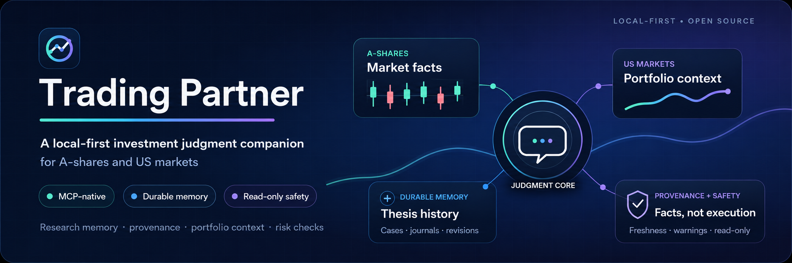

# Trading Partner

**The local-first memory and monitoring layer for serious investment conversations.**

[](https://github.com/KarlZhu-ZXC/trading-partner/actions/workflows/quality.yml)
[](https://github.com/KarlZhu-ZXC/trading-partner/releases)
[](https://www.python.org/)
[](LICENSE)
[](https://paypal.me/xczhu)

<p align="center">
  
</p>

Most AI investment chats can summarize today's market. They do not remember why you
bought, what would invalidate the idea, how the plan changed, or whether new evidence
contradicts last month's judgment.

Trading Partner gives Codex and other
[Model Context Protocol](https://modelcontextprotocol.io/) hosts that missing layer:
durable research memory, read-only portfolio context, provider-backed facts, and
transition-aware monitoring—without giving the model permission to trade.

> **Ask:** “Review my gold position. What changed since the original thesis, and
> what evidence would make the current plan invalid?”
>
> **Trading Partner restores:** the confirmed position, Research Subject, competing
> Theses, Trade Plan, latest market facts, Monitor observations, provenance, and data
> quality warnings. The AI host interprets and challenges them in the conversation.

<p align="center">
  <a href="#product-tour"><strong>See the product flow</strong></a>
  ·
  <a href="#quick-start"><strong>Quick start</strong></a>
  ·
  <a href="docs/guide/mcp-capability-boundary.md"><strong>Capability boundary</strong></a>
</p>

<p align="center">
  <sub>If this is the investment workflow you want AI hosts to support, a ⭐ helps more people find the project.</sub>
</p>

<a id="product-tour"></a>
##  60-second product tour

```text
You ask in Codex
    ↓
Trading Partner restores your portfolio, Watchlist, research history, and active plan
    ↓
Provider-backed facts arrive with source, timestamp, freshness, and typed warnings
    ↓
Codex compares the new evidence with PRIMARY, SUB, COMPETITOR, and BEAR Theses
    ↓
Deterministic or composite Monitors persist every observation and notify only on change
    ↓
You explicitly confirm durable judgments and every live broker order; automation never trades
```

| Built for | What it changes |
|---|---|
| Long-horizon research | One durable file keeps the question, evidence, Thesis history, decisions, and open questions together. |
| Portfolio-aware conversations | The host can use persisted positions, transactions, Watchlists, performance, and risk without silently refreshing a broker. |
| Judgment monitoring | Price, technical, relative-strength, fundamental, macro, sentiment, and portfolio-risk conditions can be evaluated on a schedule. |
| Trustworthy answers | Facts retain provenance, observation time, freshness, fallback basis, and typed failures instead of hiding uncertainty. |

The durable research object is called a **Research Subject**（研究标的/研究档案）.
It may represent a company, ETF, theme, macro question, catalyst, or portfolio concern;
it is not limited to an equity. The legacy `investment_case_*`, `case_id`, and opaque
`case_…` names remain only at compatibility boundaries.

##  Why Trading Partner?

Most investment chats forget what you believed last month, why you bought something,
which evidence would invalidate the thesis, and whether a new claim contradicts an
older one. Trading Partner gives the conversation a persistent research memory and a
fact layer designed to challenge decisions over time—not merely summarize today's
market.

Every precise result carries provenance such as source, observation time, freshness,
basis, and typed warnings. Missing or stale data is disclosed instead of fabricated.

##  Core capabilities

- **Research memory:** Research Subjects, multiple Thesis threads, journals,
  decisions, evidence, Catalyst Agenda, Judgment Scorecards, Challenge Reviews,
  and versioned Trade Plans.
- **Portfolio context:** Schwab, Moomoo OpenD, or strict CSV holdings; durable
  transactions, Watchlists, performance attribution, exposure, and Risk Engine v2.
- **Market facts:** A-share, US, Korea Exchange, macro, company filings, sentiment,
  selected futures, and explicitly labelled OTC/cross-asset references.
- **Monitoring:** deterministic facts plus optional bounded composite judgment,
  immutable run diagnostics, and transition-aware Telegram delivery.
- **Technical analysis:** shared daily/weekly indicators, market structure,
  support/resistance, candlestick patterns, and auditable charts.
- **Safe workflows:** deep dives, catalyst and market reviews, peer comparisons,
  deterministic Trade Retro, a manual QuantConnect Free code/result bridge, and a
  Schwab SGOV cash-sweep Shadow Preview plus confirmation-gated US stock/ETF orders.

<details>
<summary><strong>Expand the complete implemented capability list</strong></summary>

<br />

- Maintain a durable research file for an instrument or higher-level topic, including
  its current investment judgments, revision history, journals, decisions, and
  contrary-first Challenge Reviews.
- Resolve A-share, US, and selected Korea Exchange instruments and retrieve provider-backed market,
  fundamental, filing, macro, news, sentiment, and prediction-market context.
- Resolve supported typed IDs automatically on first use and fetch up to 50 quotes
  per bounded batch with one typed result per instrument.
- Read positions and a deduplicated native-currency activity ledger from Schwab or
  Moomoo OpenD, with machine-readable history/snapshot coverage before P/L claims;
  strict manual CSV remains available for holdings
  sources; durable reads never contact a broker, while refresh is explicit and read-only.
- Refresh Schwab `cashBalance`, margin balance, positions, and supported active
  one-leg open orders, then preview an SGOV cash sweep from the broker ask. The
  preview subtracts a $2,000 hard cash floor, $200 operating buffer, and open
  BUY-order reserve,
  emits the exact proposed Schwab LIMIT/DAY/NORMAL payload, and always returns
  `execution_effect=false`; the scheduled plan never submits an order.
- Preview and, only after an explicit current-chat confirmation, submit or cancel one
  exact Schwab US stock/ETF order. Live intents expire within 30–300 seconds, use
  `cashBalance` rather than buying power, block margin and overselling, persist an
  audit receipt, and never retry an uncertain write response.
- Generate the same calculation for all refreshed Schwab accounts at 15:45 ET on
  normal XNYS sessions (15 minutes before official early closes), persist one
  idempotent daily Outbox receipt, and optionally send the plan through Telegram.
- Persist Moomoo or CSV Watchlists with group and membership history; Moomoo's
  aggregate `All` group is the default durable read scope.
- Analyze portfolio exposure, simulate additions, and run deterministic Risk Engine v2
  checks without placing orders.
- Calculate durable native-currency FIFO or broker-basis performance summaries with
  realized/unrealized P/L, dividends, interest, fees, cash flows, event drill-down,
  and explicit `INCOMPLETE` status when history or valuation evidence is insufficient.
- Capture Trade Plans and confirmed Decision Records before a review period, then
  compare them with durable broker transactions in an immutable Trade Retro. Missing
  coverage or pre-trade evidence stays explicit; optional Chinese narration cannot
  mutate research state or orders. Human review is editable through append-only,
  version-checked revisions for dispositions, correction notes, and action items;
  Obsidian export touches only an owned block.
- Maintain an append-only Catalyst Agenda for user-confirmed or free-provider
  earnings, dividend, split, and selected FRED macro dates. Date changes retain
  history; completed items link to durable Event/Report/Evidence facts instead of
  being inferred from news.
- Generate immutable Judgment Scorecards for one exact Thesis revision. The cards
  expose evidence balance, recency, invalidation/plan/Monitor/Retro discipline, and
  Catalyst outcome calibration without producing a single opaque score.
- Propose and explicitly confirm versioned Trade Plans, calculate non-executing A-share/US
  position-sizing ranges, and compile machine-evaluable plan conditions into durable monitors.
- Open a theme Research Subject before an execution product is known, propose an
  Instrument, and attach it directly after explicit confirmation. A later Trade Plan
  chooses its execution Instrument explicitly without rewriting the research scope.
  Older Instrument Selection statuses remain readable for durable compatibility but
  are not extra steps in the normal workflow.
- Create durable price, volume, technical, fundamental, company-event, macro, sentiment,
  Thesis-state, and portfolio-risk monitors with transition-only events.
- Run venue-aware XAUUSD/XAGUSD/light-oil interval monitoring that sleeps through
  known Dukascopy closures. During the weekend, current XAUUSD rules use Binance
  PAXG/USDC and current `USOIL`/light-oil rules use Hyperliquid XYZ CL/USDC as
  explicitly labelled proxies. Optional IG Weekend Gold remains a last-resort
  XAUUSD fallback; none of these references is relabelled as spot or a benchmark.
  Retryable weekend-reference failures receive three bounded attempts, and each
  failed route stage is retained as a secret-safe diagnostic in the Monitor Run.
- Produce shared A-share/US/KR daily and weekly technical analysis, including indicators,
  market structure, support/resistance, candlestick patterns, and PNG charts.
- Retrieve free COMEX/NYMEX continuous metal-futures facts with Yahoo primary,
  scoped Sina quote and Eastmoney daily-derived fallbacks, and 1m–monthly
  bars with explicit non-spot and contract-roll warnings.
- Resolve formal CME metal contracts, build official-reference settlement curves,
  and read DCE live-hog EOD contract facts through one shared futures model.
- Read free Dukascopy XAUUSD/XAGUSD broker-feed quotes and bars plus separately
  labelled rolling copper and light-oil CFDs. `USOIL` resolves to the latter but
  is never relabelled as WTI spot or a NYMEX `CL` contract.
- Retrieve official national hog-cycle price, feed, pig-grain-ratio, and capacity
  observations with publication-time cutoffs and no fabricated phase verdict.
- Run repeatable deep-dive, catalyst, market-review, portfolio-review, and explicit
  same-market peer-comparison workflows while keeping the AI host as the synthesizer.
- Prepare hashed LEAN strategy packages for user-operated QuantConnect Free web
  backtests and import downloaded result JSON with explicit reproducibility gaps.
- Browse system health, a durable-only Data Quality Center, every Research Subject
  and Thesis, Trade Retro Run/review history, all 27 MCP capabilities, Monitor runs/events, accounts, and
  operational state in a local web console with an opt-in Shared Agent Chat. Its Attention Queue links
  pending research candidates, failed Monitor runs, data-quality gaps, and
  notification failures to the relevant workspace. An explicit Monitor run may
  invoke the configured server-side LLM only when that Monitor has an enabled
  composite judgment policy; Trade Retro may optionally use the same bounded model
  layer only to narrate already-computed deterministic findings.

</details>

##  Safety boundary

Trading Partner is a research-first service, not an autonomous trading agent.

It exposes a deliberately narrow Schwab order boundary for explicitly confirmed,
single-leg US stock/ETF orders. Preview, submit, status, and cancel share one grouped
`broker_order_manage` tool; there is no generic broker request, autonomous execution,
order replacement, options/complex-order builder, or unattended cash sweep. Its
QuantConnect Free
bridge only prepares code and imports a result after the user operates the web UI.
Every live submit consumes a short-lived durable preview and exact user authorization;
an unknown Provider response is recorded as `UNKNOWN` and never submitted again automatically.
The v1 contract supports `LIMIT` and `STOP_LIMIT` BUY/SELL orders plus protective
`MARKET`, `STOP`, `TRAILING_STOP`, and `TRAILING_STOP_LIMIT` SELL orders. `AM`, `PM`,
and `SEAMLESS` accept LIMIT orders only; `SEAMLESS` ends at 20:00 ET and does not
represent Schwab's separate overnight session. Unbounded BUY market/stop/trailing
orders are blocked by the no-margin cash guard.
Technical outputs are derived facts—not forecasts, strategies, or trade signals.
Ordinary portfolio questions read durable snapshots; broker refreshes happen only
when explicitly requested.

<a id="quick-start"></a>
##  Quick start

Requirements:

- [uv](https://docs.astral.sh/uv/)

Install the core MCP from the versioned project tag, then initialize its private
per-user runtime:

```bash
uv tool install --python 3.13 \
  "git+https://github.com/KarlZhu-ZXC/trading-partner.git@v0.6.0"
trading-partner-init
```

`trading-partner-init` creates an owner-only `runtime.env`, initializes or upgrades
the SQLite database idempotently, and prints the absolute MCP command and arguments.
It requires no API key or broker login. Add optional Provider credentials only to
that generated file.

Copy the printed command and `--env-file` argument into your MCP host. Tested Claude
Desktop, Cursor, and generic stdio recipes are in the
[MCP host setup guide](docs/guide/mcp-host-setup.md); a concise
[中文快速开始](docs/guide/quickstart-zh.md) is also available.

For a source checkout or optional Console development, use the contributor path:

```bash
git clone https://github.com/KarlZhu-ZXC/trading-partner.git
cd trading-partner
uv sync
cp .env.example .env
uv run alembic upgrade head
uv run trading-partner-mcp
```

The source checkout installs the complete development environment. Optional runtime
extras remain scoped to `accounts-moomoo`, `accounts-schwab`, `chart`, `company-pdf`,
and `console`; `trading-partner[all]` installs all of them. Node.js 22.13 or newer is
required only for the optional Console frontend.

After connecting, call `system_health` first. Then verify the specific market and
account providers you intend to use; a healthy MCP process does not imply that every
optional external provider is configured or reachable. Health output labels local
live probes separately from configuration-only checks. The same response now embeds
a durable-only Data Quality Center for account valuation/time coverage, activity
coverage receipts, latest Monitor blind spots, and recent secret-safe Provider
route/fallback outcomes; it never refreshes a broker or market-data Provider.
Operational health and evidence quality keep separate statuses.
The local Console renders both on its overview page.

##  Local Console

The optional Console is a loopback-only control room running over the same
application services and the 27-capability MCP vNext registry, with an opt-in
Shared Agent rail that stays beside the active page. Start the API and
frontend in separate terminals:

```bash
# Terminal 1
uv sync --extra console
uv run trading-partner-console

# Terminal 2
cd console
npm ci
npm run dev
```

Open `http://localhost:3000`. Pages cover the Attention/Review Queue, Research
Subjects and Thesis work, versioned Trade Plans, Trade Retro, Catalyst Agenda,
Judgment Scorecards, Monitor definitions/runs/events, durable Holdings,
Activity, Performance, and Risk views, operational receipts, and a Market &
Technical Lens with the generic 27-tool capability workbench.

Page loads are durable-only and never contact Providers. Writes and external
actions require an explicit click and keep the underlying confirmation,
expected-version, actor, and idempotency gates. The Console has no live order
control; live Schwab orders are available only through the confirmation-gated
MCP operation. The browser
frontend manages its own process-local session token, and an optional
password-protected LAN mode serves trusted home networks.

See the [local Console and maintenance guide](docs/operations/local-console-and-maintenance.md)
for page-by-page detail, the session boundary, LAN mode, the Shared Agent
supervisor, and scheduler setup.

##  Operational commands

```bash
# Exact Watchlist refresh
uv run trading-partner-watchlist-sync

# Due-checked US post-market account and Watchlist refresh
uv run trading-partner-post-market-sync

# Refresh Schwab and print an immediate SGOV Shadow purchase-plan table
uv run trading-partner-sgov-plan preview

# Install the token-free 15:45 ET daily Shadow-plan scheduler
uv run trading-partner-sgov-plan-scheduler install
uv run trading-partner-sgov-plan-scheduler status

# Before a week starts, freeze the Trade Plans and Decision Records to audit
uv run trading-partner-retro prepare \
  --start 2026-08-10 --end 2026-08-17 \
  --idempotency-key retro-plan-2026-w33

# After that period, audit durable transactions and optionally export to Obsidian
uv run trading-partner-retro run \
  --start 2026-08-10 --end 2026-08-17 \
  --idempotency-key retro-run-2026-w33 --export-obsidian

# Durable-only history; this never refreshes a broker
uv run trading-partner-retro history

# Scheduler-friendly: review Monday→Saturday, export, then snapshot next week
uv run trading-partner-retro weekly --export-obsidian

# Diagnose Schwab token age without opening a browser
uv run trading-partner-schwab-auth status

# Inspect one owner-only Schwab Realized Gain/Loss CSV for A1 reconciliation
uv run trading-partner-performance-reconciliation inspect-schwab-realized \
  --realized-csv schwab-realized-2026-06.csv

# Compare one statement account/month with durable FIFO attribution
uv run trading-partner-performance-reconciliation compare-schwab-realized \
  --realized-csv schwab-realized-2026-06.csv \
  --account-ref schwab_STABLE_ACCOUNT_REF \
  --statement-account-ref schwab_statement_HASH_FROM_INSPECT \
  --month 2026-06

# Manually force one market-close cadence (diagnostic use)
uv run trading-partner-monitor-run --cadence US_POST_MARKET
uv run trading-partner-monitor-run --cadence A_SHARE_POST_MARKET
uv run trading-partner-monitor-run --cadence KR_POST_MARKET

# Install the token-free unified hourly dispatcher
uv run trading-partner-monitor-scheduler install
uv run trading-partner-monitor-scheduler status

# Due-check INTERVAL plus A-share/US/KR post-market groups
uv run trading-partner-monitor-run due

# Optional Telegram delivery: inspect, test, or retry the durable outbox
uv run trading-partner-monitor-notifications status
uv run trading-partner-monitor-notifications test
uv run trading-partner-monitor-notifications flush

# Explicitly refresh free futures definitions and persist EOD statistics
uv run trading-partner-futures-sync --product CME:GC --trade-date 2026-07-24

# Explicitly refresh current Yahoo dates and selected FRED release calendars
uv run trading-partner-catalyst-sync sync \
  --fred-release-id 10 --fred-release-id 46 --window-days 30 --notify --flush

# Read the latest durable Catalyst Agenda sync receipt without Provider access
uv run trading-partner-catalyst-sync status

# Start the loopback-only console API (frontend: cd console && npm run dev)
uv sync --extra console
uv run trading-partner-console

# Inspect retention, create a backup, or preview expired-cache pruning
uv run trading-partner-maintenance status
uv run trading-partner-maintenance backup
uv run trading-partner-maintenance prune-cache --retention-days 30
```

These commands never execute an order.

Broker-statement inspection and comparison accept only a relative CSV path below
the gitignored `data/artifacts/reconciliation/` directory, restrict it to
owner-only permissions, and emit hashes plus redacted summaries—never raw rows
or account labels. Comparison is durable-only and records an owner-only JSON
draft; neither a matching draft nor the command itself constitutes sign-off.

Telegram delivery is opt-in: create a bot with `@BotFather`, message it once,
then set `NOTIFICATIONS_ENABLED`, `TELEGRAM_BOT_TOKEN`, and `TELEGRAM_CHAT_ID`
in the gitignored `.env`. The durable Outbox retries pending messages on the
hourly dispatcher without consuming model tokens; the
[maintenance guide](docs/operations/local-console-and-maintenance.md) records
the delivery, retry, and LLM-boundary contract.

The optional Telegram Agent long-poller is independent of Monitor delivery.
Enable `TELEGRAM_AGENT_ENABLED` once the generic `LLM_*` endpoint is
configured, and reuse the same bot's numeric `TELEGRAM_CHAT_ID` allowlist
(negative group chats additionally require `TELEGRAM_AGENT_USER_ID`). Unknown
chats or users are silently ignored. Proposed actions surface as opaque
one-time `c:<token>` / `r:<token>` callbacks without action parameters, and
delivery is at-most-once across restarts. Manage the poller with:

```bash
uv run trading-partner-agent telegram run
uv run trading-partner-agent telegram status
uv run trading-partner-agent telegram install
uv run trading-partner-agent telegram uninstall
```

##  Architecture

```text
src/
├── bootstrap.py          # composition root
├── application/          # ports, DTOs, use cases
├── domain/               # pure domain model
├── infrastructure/       # composition builders, persistence, providers, config
└── interfaces/           # MCP, Console, and CLI adapters
```

```text
interfaces ───────→ application ───────→ domain
infrastructure ───→ application ports ─→ domain
```

The domain has no dependency on MCP, SQLAlchemy, Alembic, settings, or provider
SDKs. Provider payloads are normalized at the infrastructure boundary, and only
`src/bootstrap.py` connects infrastructure ports to application services.
Layer responsibilities, composition rules, and the boundary tests that enforce
them are documented in [AGENTS.md](AGENTS.md).

##  Data-source routing

The diagram shows the runtime source chain, including scoped fallbacks. A fallback
never changes an instrument's identity or silently upgrades a broker/derived value
into an official benchmark.

```mermaid
flowchart TB
    Host[Codex or another MCP host] --> MCP[Trading Partner MCP<br/>27 vNext capabilities]
    MCP --> App[Application services<br/>cutoffs · freshness · typed degradation]
    App --> Router[Asset-aware Provider Router<br/>cache · limiter · fallback policy]
    App <--> Store[(SQLite / configured DB<br/>research memory · subjects · plans<br/>snapshots · watchlists · monitors)]

    subgraph CN[A-share facts]
        CNMarket[Tencent · Eastmoney · Sina<br/>quotes · bars · capital]
        CNDisclosure[CNINFO · SSE · SZSE<br/>filings · operating disclosures]
        CNSentiment[THS · Eastmoney rankings<br/>CLS · optional iWencai]
        CNIndustry[NAHS<br/>official hog-cycle observations]
    end

    subgraph US[US market and company facts]
        Yahoo[Yahoo Finance<br/>quotes · bars · screeners · news]
        AV[Alpha Vantage key pool<br/>market/company fallback]
        SEC[SEC EDGAR<br/>filings · point-in-time company facts]
        FRED[FRED / ALFRED<br/>vintage-safe macro]
        Social[Reddit RSS → Apify fallback<br/>Moomoo public community feed]
        Prediction[Polymarket<br/>current probabilities]
    end

    subgraph KR[Korea Exchange market facts]
        KRYahoo[Yahoo Finance<br/>.KS · .KQ · KOSPI/KOSDAQ indices<br/>quotes · bars]
        XKRX[XKRX calendar<br/>holiday-aware post-market cadence]
    end

    subgraph Cross[Metals, futures, and cross-asset]
        Continuous[Yahoo continuous futures<br/>→ Sina quote fallback<br/>→ Eastmoney daily-bar fallback]
        CME[CME public reference<br/>contracts · settlement · curve]
        DCE[DCE public EOD<br/>live-hog contracts · settlement]
        Jetta[Dukascopy Jetta keyless<br/>XAUUSD · XAGUSD · rolling copper/light-oil CFDs]
        WeekendRWA[Binance PAXG/USDC · Hyperliquid XYZ CL/USDC<br/>current weekend proxies · explicit basis risk]
        IGWeekend[IG Weekend Gold via Apify browser<br/>last-resort XAUUSD weekend fallback]
        Legacy[optional legacy Dukascopy key API]
        Jetta -. failure with configured key .-> Legacy
        Jetta -. weekend closure .-> WeekendRWA
        WeekendRWA -. gold proxy unavailable .-> IGWeekend
    end

    subgraph Personal[Personal read-only context]
        Accounts[Schwab · Moomoo OpenD · manual CSV<br/>balances · positions · transactions]
        Watchlists[Moomoo OpenD or manual CSV<br/>one active upstream]
        Hot[Moomoo OpenD Hot List<br/>optional market context]
    end

    Router --> CNMarket
    Router --> CNDisclosure
    Router --> CNSentiment
    Router --> CNIndustry
    Router --> Yahoo
    Router --> AV
    Router --> SEC
    Router --> FRED
    Router --> Social
    Router --> Prediction
    Router --> KRYahoo
    App --> XKRX
    Router --> Continuous
    Router --> CME
    Router --> DCE
    Router --> Jetta
    Router --> WeekendRWA
    Router --> IGWeekend
    App --> Accounts
    App --> Watchlists
    Router --> Hot

    Proxy[optional PROVIDER_PROXY_URL<br/>CME · DCE · Dukascopy · weekend references · Polymarket] -. network route .-> Router
```



Provider pacing rules, fallback selection policy, and typed degradation
semantics for each hop are recorded in [AGENTS.md](AGENTS.md).

##  Data and secrets

- Static secrets live in the project-root `.env`, which is gitignored.
- Rotating provider OAuth tokens live under `data/secrets/`, which is also gitignored.
- Durable research and account state stays in your configured local database.
- Credentials are redacted from logs, MCP envelopes, exceptions, and audit payloads.
- Each user should supply their own provider credentials and maintain their own data
  store; never share an `.env` or broker token directory.

##  Documentation

- [MCP capability and trust boundary](docs/guide/mcp-capability-boundary.md)
- [MCP host setup: Claude Desktop, Cursor, and generic stdio](docs/guide/mcp-host-setup.md)
- [中文快速开始](docs/guide/quickstart-zh.md)
- [Local Console and maintenance](docs/operations/local-console-and-maintenance.md)
- [QuantConnect Free manual validation](docs/guide/quantconnect-free-bridge.md)
- [Documentation index](docs/README.md)
- [Known operational issues](docs/operations/known-issues.md)
- [Product roadmap](docs/roadmap/global-roadmap-cn-us.md)
- [Contributing guide](.github/CONTRIBUTING.md)
- [Security policy](SECURITY.md)

##  Development

```bash
uv run ruff check .
uv run mypy src
uv run pytest
uv run python scripts/smoke_isolated_wheel.py
uv run pip-audit
uv run cyclonedx-py environment .venv/bin/python --pyproject pyproject.toml -o /tmp/trading-partner.cdx.json
cd console && npm ci && npm audit && npm run lint && npm test
gitleaks git --redact --no-banner --log-opts=HEAD
```

Upstream projects under `references/` are design references only and are not runtime
dependencies. See each `UPSTREAM.md` for its pinned revision and attribution.

##  Support

Questions, bug reports, Provider proposals, and focused contributions are welcome
through [GitHub Issues](https://github.com/KarlZhu-ZXC/trading-partner/issues).
Please read the [contributing guide](.github/CONTRIBUTING.md) and keep credentials
and personal financial data out of public reports.

If Trading Partner is useful to you, consider
[buying me a coffee through PayPal](https://paypal.me/xczhu).

[](https://paypal.me/xczhu)

##  License

Licensed under [Apache License 2.0](LICENSE). Third-party attribution is recorded in
[NOTICE](NOTICE).
